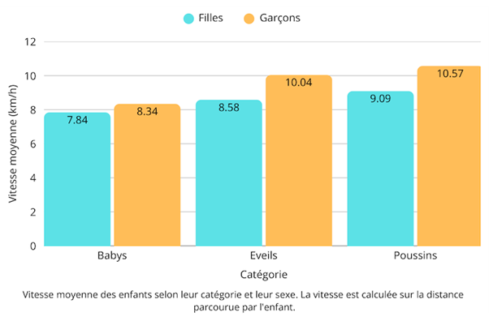
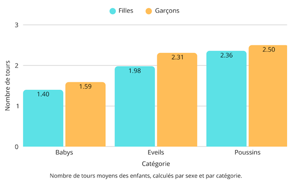
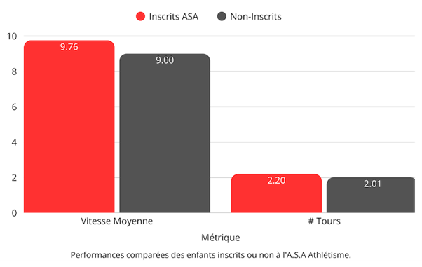

# De beaux résultats pour nos enfants de l’A.S.A Athlétisme !

La Course Populaire, organisée lors de la Maisonnaise 2025, a été un franc succès avec pas moins de 726 participants. Enfants et adultes confondus se sont essayés sur les 3 tours de ce parcours atypique, dans la joie et la bonne humeur.

Notre partenaire, Oxybol, a récupéré l’ensemble des temps de chacun, que vous pouvez consulter sur le lien suivant : [G-Live](https://glive.oxybol.fr/public/g-live.html?f=../oxybol/Maisonnaise/2025/LaMaisonnaise.clax). Nous avons donc pu récupérer ces temps et effectuer une petite analyse, que nous présentons ici !

## Hypothèses

Dans cette analyse, nous allons nous concentrer sur deux métriques :

- la vitesse moyenne, qui sera exprimée en km/h et calculée sur la distance parcourue par l’enfant,
- la distance parcourue par l’enfant, qui sera exprimée en nombre de tours.

Nous n’allons en particulier pas considérer le temps final car, étant donné que la course n’imposait pas la distance (chacun était libre de parcourir un, deux ou trois tours), cette métrique n’aurait pas beaucoup de sens.

De plus, la course étant principalement destinée aux enfants, et sachant que de nombreux participants adultes sont venus pour accompagner leurs enfants, nous allons nous restreindre aux performances des enfants, soit les catégories Babys (4/6 ans), Éveils (7/9 ans) et Poussins (10/11 ans). Par la suite, nous allons désigner par “catégorie” ces différentes tranches d’âges.

Dans toute l’analyse, nous allons considérer les trois variables suivantes, que nous supposons ayant une influence sur les performances : l’âge (pris en compte via la catégorie), le sexe et l’appartenance à notre club (i.e. si l’enfant est inscrit à l’A.S.A Athlétisme ou non).

## Résultats Globaux

Commençons par analyser les performances moyennes de tous les enfants. Commençons notamment par calculer les vitesses moyennes selon la catégorie et le sexe, que nous représentons ci-après. Étant donné que tous les athlètes n’ont pas tous parcouru la même distance, cette métrique doit être considérée en regard du nombre de tours moyens, reportés plus bas.

Nous remarquons que les Poussins ont logiquement couru plus vite que les Éveils et les Babys, et que les garçons ont couru un peu plus vite que les filles. Quelle que soit la catégorie, nous constatons que les vitesses moyennes sont tout de même assez impressionnantes pour de jeunes enfants, avec des Babys (moins de 6 ans) qui courent à environ 8km/h et des Poussins (10/11 ans) à 10km/h en moyenne !

Le nombre de tours parcouru est aussi une métrique d’intérêt, puisque la Course Populaire permettait d’en faire un, deux ou trois selon les envies. Les résultats, calculés par catégorie et par sexe, sont fournis ci-dessous.

Les tendances observées pour les vitesses moyennes se retrouvent de nouveau sur le graphique ci-dessus, avec des Poussins qui ont parcouru en moyenne plus de tours que les Éveils et les Babys, et les garçons qui ont parcouru un peu plus de tours que les filles. Il est important de remarquer tout de même que la plupart des enfants de 7 ans ou plus (Éveils & Poussins) ont parcouru plus de 2 tours, ce qui représente tout de même 3.33 kilomètres !

## Résultats des athlètes de l’A.S.A

Les résultats qui nous intéressent sont plus particulièrement ceux des enfants inscrits au club. En effet, avons-nous fait du bon travail avec eux depuis le début de l’année, et est-ce que ce travail s’observe sur la course ? Plus particulièrement, est-ce que les enfants inscrits au club sont allés plus vite, ou ont fait plus de tours, que les autres ?

Pour répondre à cette question, nous avons croisé la liste des participants avec la liste de nos adhérents des sections Babys, Éveils et Poussins, et ainsi pu déterminer qui parmi ces premiers était aussi inscrit au club. Nous avons alors pu comparer les performances des inscrits à celles des non-inscrits. Nous représentons les résultats ci-dessous.

Quel soulagement ! les enfants inscrits au club sont bel et bien plus performants que les autres, avec une vitesse moyenne de 9.76 km/h comparée à 9 km/h pour les autres, soit une amélioration moyenne de 8.49% ! De même, les enfants du club ont parcouru en moyenne 2.20 tours comparés aux 2.01 tours des autres soit une amélioration de 9.54%.

Note : ces résultats ont été validés par des tests statistiques, qui ont livré des p-valeurs de 0.01 pour la vitesse moyenne et 0.076 pour le nombre de tours. Nous sommes donc dans les deux cas inférieurs à 0.1, ce qui est une borne acceptable. Pour nous en tout cas !

## Pour aller plus loin

L’analyse précédente présente tout de même une faille. En effet, attribuer la différence observée entre les deux groupes uniquement à leur entraînement au club suppose que toute chose soit égale par ailleurs. En particulier, cela suppose que chaque sexe et catégorie d’âge soit équitablement répartie entre les deux groupes, vu que nous avons vu précédemment que ces deux facteurs avaient une grande influence sur les performances observées.

Pour s’affranchir de cette hypothèse, nous pouvons effectuer une analyse statistique plutôt simple nommée Régression Linéaire. Cette analyse consiste à modéliser chaque grandeur cible par une combinaison linéaire de tous les facteurs que l’on suppose influent, que l’on nomme inducteurs. L’objectif est d’incorporer tous les inducteurs à disposition, afin de prendre un maximum de facteur en compte. Cette analyse permet de fournir un coefficient à chaque inducteur, dont l’appartenance à notre club. Ce coefficient représentera l’apport moyen de l’inducteur sur la performance ciblée. Cet apport tiendra donc compte de tous les inducteurs impliqués dans la modélisation, et livrera donc une analyse plus robuste, qui ne requiert pas l’hypothèse de l’analyse précédente.

Fort heureusement, cette nouvelle analyse n’invalide pas la précédente, et les coefficients observés sont peu ou prou similaires à ceux déterminés par l’analyse précédente, comme l’atteste le tableau suivant.

| performance considérée | coefficient | incrément |
| --- | --- | --- |
| vitesse moyenne sur la course | 0.74 km/h | 8.25% |
| nombre de tours parcourus | 0.24 | 11.76% |

Nous constatons que, lorsque les autres facteurs dont nous disposons sont pris en compte (à savoir l’âge, via la catégorie, et le sexe), l’incrément de performance apporté par l’inscription au club passe à 0.74 km/h pour le vitesse moyenne (comparé aux 0.76 estimés par l’analyse précédente) et 0.24 tours pour la distance parcourue (comparé aux 0.19 de l’analyse précédent). En somme, les ordres de grandeurs sont préservés !

## Conclusion

Tout d’abord, nous souhaitons remercier tous les participants à cette édition 2025 de la Maisonnaise et en particulier de la Course Populaire, adultes et enfants, membres du club ou non, confondus ! Ce fut une belle course, un bel évènement et l’on espère vous revoir nombreux pour la prochaine édition.

Enfin, nous sommes particulièrement fier des performances de tous les enfants, et en particulier des enfants du club qui ont fièrement représentés le club en portant nos couleurs et via leur engagement dans la course. Et enfin, nous sommes heureux de voir que notre travail commun, enfants et entraîneurs du club, a porté ses fruits. Vive l’athlétisme !